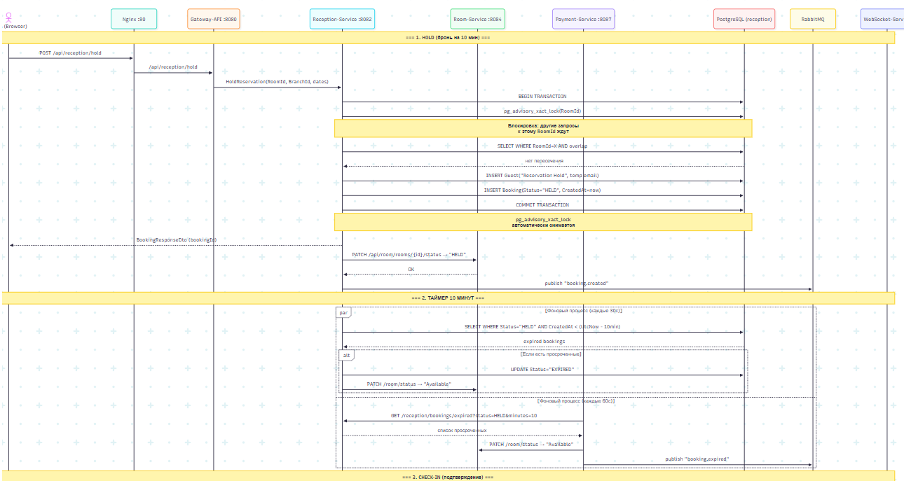
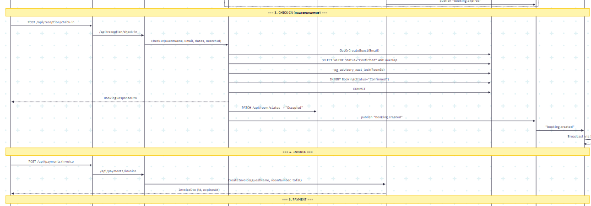
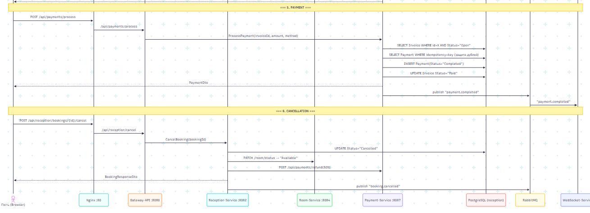
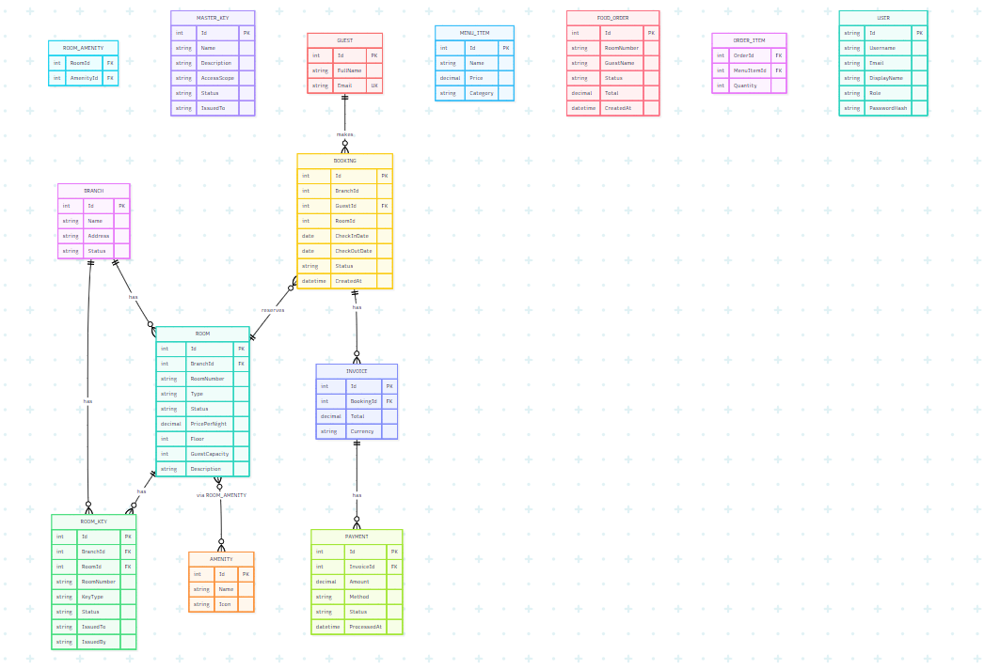

# HotelOS — Hotel Management System

A full-stack hotel management system with **8 .NET microservices**, a **React + TypeScript frontend**, **PostgreSQL** databases, **RabbitMQ** event bus, and a **YARP API Gateway**.

## Architecture

```
nginx (port 80)
  └── /api/* → gateway-api (YARP)
  │     ├── /api/reception/*  → reception-service
  │     ├── /api/room/*       → room-service
  │     ├── /api/auth/*       → user-service
  │     ├── /api/payments/*   → payment-service
  │     ├── /api/maintenance/* → maintenance-service
  │     ├── /api/housekeeping/* → housekeeping-service
  │     ├── /api/notifications/* → websocket-service
  │     └── /api/admin/*      → gateway-api / user-service
  └── /hubs/* → gateway-api (SignalR → websocket-service)
  └── /*     → frontend (React SPA)
```

## Prerequisites

- [Docker Desktop](https://www.docker.com/products/docker-desktop/) (for running all services)
- [.NET 8 SDK](https://dotnet.microsoft.com/download/dotnet/8.0) (for local development)
- [Node.js 20+](https://nodejs.org/) (for frontend development)
- [Git](https://git-scm.com/)

## Quick Start (Docker)

### 1. Clone

```bash
git clone <repo-url>
cd hotelos
```

### 2. Environment

Copy the example env file (defaults work for Docker):

```bash
cp .env.example .env
```

### 3. Start all services

```bash
docker compose up -d
```

This starts:
- **PostgreSQL** (port 5432)
- **RabbitMQ** (ports 5672, 15672)
- **8 .NET microservices** (internal ports)
- **React frontend** via nginx (port 80)
- **nginx** reverse proxy (port 80)

### 4. Open the app

- **Frontend:** http://localhost
- **pgAdmin:** http://localhost:5050 (admin@hotelos.dev / admin123)
- **RabbitMQ UI:** http://localhost:15672 (guest / guest)
- **Swagger docs:** http://localhost/docs

### 5. Default credentials

| Role    | Email              | Password   |
|---------|--------------------|------------|
| Admin   | admin@hotelos.com  | admin123   |
| Guest   | guest@hotelos.com  | guest123   |

## Development (without Docker)

You can run services individually for faster development.

### Backend

```bash
# Restore & build
dotnet restore backend/HotelOS.sln
dotnet build backend/HotelOS.sln

# Run a specific service
dotnet run --project backend/services/gateway-api
dotnet run --project backend/services/room-service
# ... etc.
```

### Frontend

```bash
cd frontend
npm install
npm run dev
```

The dev server starts at http://localhost:5173.

### Databases

Each microservice has its own PostgreSQL database:

| Service            | Database               | Schema        | Init method      |
|--------------------|------------------------|---------------|------------------|
| gateway-api        | hotelos_gateway        | audit, users  | MigrateAsync     |
| user-service       | hotelos_users          | users         | MigrateAsync     |
| room-service       | hotelos_room           | room_service  | MigrateAsync     |
| reception-service  | hotelos_reception      | reception     | EnsureCreated    |
| websocket-service  | hotelos_websocket      | websocket     | EnsureCreated    |
| payment-service    | hotelos_payments       | payments      | EnsureCreated    |
| maintenance-service| hotelos_maintenance    | maintenance   | EnsureCreated    |
| housekeeping-service| hotelos_housekeeping  | public        | EnsureCreated    |

You need PostgreSQL running locally. The `docker/database-migrator/init.sh` script creates all databases and schemas.

### Environment Variables

Set these in your shell or `appsettings.Development.json`:

```bash
# Database connection
ConnectionStrings__Postgres="Host=localhost;Port=5432;Database=hotelos_gateway;Username=hotelos;Password=hotelos123"

# RabbitMQ
RabbitMQ__HostName=localhost
RabbitMQ__Port=5672
RabbitMQ__UserName=guest
RabbitMQ__Password=guest

# JWT (must match across services)
Jwt__Issuer=HotelOS
Jwt__Audience=HotelOS.Web
Jwt__Key=HotelOS_dev_key_change_in_production_1234567890
```

## Project Structure

```
├── .github/workflows/      # CI pipeline
├── backend/
│   ├── HotelOS.sln         # .NET solution
│   ├── services/           # 8 microservices
│   ├── shared/             # Shared library (events, algorithms, DTOs)
│   └── tests/              # Unit, integration, and load tests
├── frontend/               # React + Vite + TypeScript + Tailwind
│   └── src/
│       ├── admin/          # Admin dashboard pages
│       ├── pages/          # Guest-facing pages
│       ├── components/     # Shared UI components
│       ├── api/            # API client
│       └── hooks/          # React hooks
├── docker/                 # Database migrator init script
├── docker-compose.yml      # Orchestration
└── nginx/                  # Reverse proxy config
```

## Changelog

```
c0597a0 docs(readme): finalize system documentation and installation guide
6338540 test(scenarios): implement verification suite for TS-01 through TS-08
af1fb7e refactor(code): apply strict coding standards and constructor injection
0149bc8 perf(db): optimize room availability queries with serializable transactions
78d7f3a fix(security): apply input validation middleware to all public endpoints
3e84193 feat(dashboard): integrate websockets for real-time operational monitoring
9d27292 feat(maintenance): add priority queue logic for technician assignments
2c8ff31 feat(room-service): implement food order state machine and queue
63f42aa feat(housekeeping): create housekeeping service and room status workflow
27c43c2 feat(broker): setup RabbitMQ connection and event bus configuration
e2868b5 feat(reception): implement room assignment algorithm with inventory logic
60265e5 feat(infra): initialize project structure and docker-compose orchestration
```

## Testing

```bash
# Backend unit tests
dotnet test backend/tests/UnitTests/HotelOS.UnitTests.csproj

# Integration tests (requires running services)
dotnet test backend/tests/IntegrationTests/HotelOS.IntegrationTests.csproj

# Load tests (requires running services)
dotnet test backend/tests/LoadTests/HotelOS.LoadTests.csproj
```




## License

MIT
